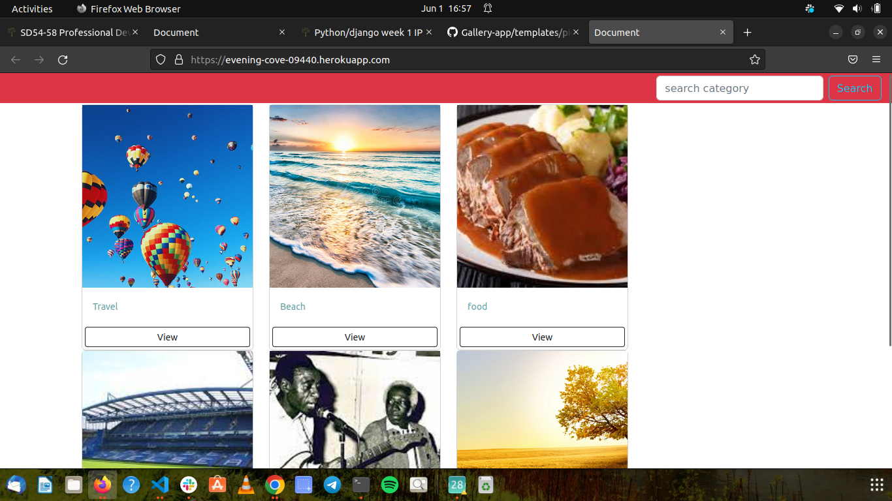

### Gallery

#### Developer: Oscar Okola

#### Description
This is Python gallery application that is used to view image and search for category of images you want to see that are in the database

#### User stories
  ##### As a user:
   1.View different photos that interest me.
   2.Click on a single photo to expand it and also view the details of the photo.
   3.Search for different categories of photos. (ie. Travel, Food)
   4.Copy a link to the photo to share with my friends.

### Technologies Used

* HTML
* CSS
*Bootstrap
* Python
* Django

# License
 MIT License

Copyright (c) [2022] [Oscar Okola]

Permission is hereby granted, free of charge, to any person obtaining a copy
of this software and associated documentation files (the "Software"), to deal
in the Software without restriction, including without limitation the rights
to use, copy, modify, merge, publish, distribute, sublicense, and/or sell
copies of the Software, and to permit persons to whom the Software is
furnished to do so, subject to the following conditions:

The above copyright notice and this permission notice shall be included in all
copies or substantial portions of the Software.

THE SOFTWARE IS PROVIDED "AS IS", WITHOUT WARRANTY OF ANY KIND, EXPRESS OR
IMPLIED, INCLUDING BUT NOT LIMITED TO THE WARRANTIES OF MERCHANTABILITY,
FITNESS FOR A PARTICULAR PURPOSE AND NONINFRINGEMENT. IN NO EVENT SHALL THE
AUTHORS OR COPYRIGHT HOLDERS BE LIABLE FOR ANY CLAIM, DAMAGES OR OTHER
LIABILITY, WHETHER IN AN ACTION OF CONTRACT, TORT OR OTHERWISE, ARISING FROM,
OUT OF OR IN CONNECTION WITH THE SOFTWARE OR THE USE OR OTHER DEALINGS IN THE
SOFTWARE.

